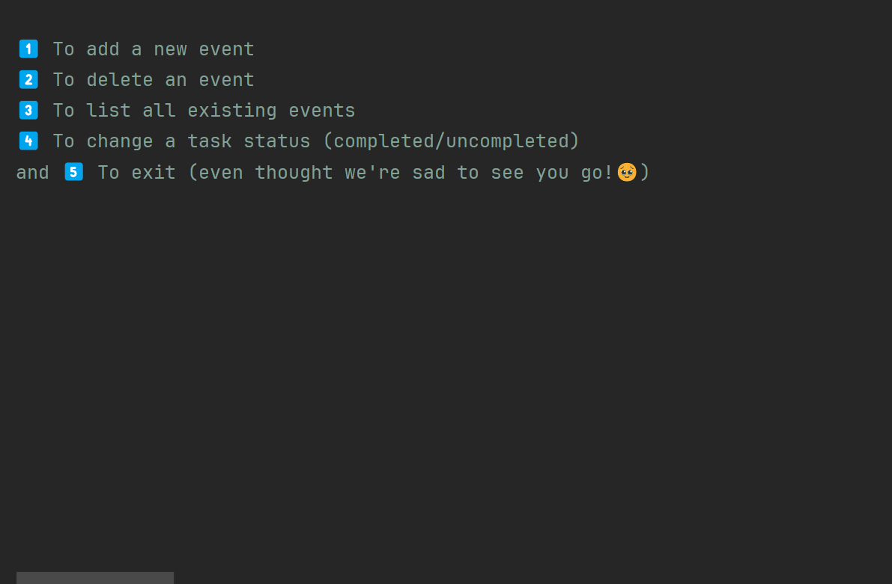

# ⭐ DAM - Exercise 4

### Objective 🎯
---
Creating a console event planner app.

### How does the app work ⚙️
---
1. A menu will display.
2. You must choose one of the following options:
   
| Option | Description |
| ----------- | ----------- |
| 1 | Add event. The program will ask for the event name, date, priority and optionally if you want to add tasks to it. |
| 2 | User can delete an existing event. |
| 3 | Program will list all existing events. |
| 4 | Marks an event task as done/undone. |
| 5 | Exits the program. |

### Demo GIF 📹
---

